# Social Media Compose

Social Media Compose is a sample app built with [Jetpack Compose](https://developer.android.com/jetpack/compose).

## Built with

- Compose
- Compose Navigation
- Accompanist
- Dagger Hilt
- ViewModel
- Coroutines
- ConstraintLayout Compose
- LiveData

##  Screenshots

### Light Mode

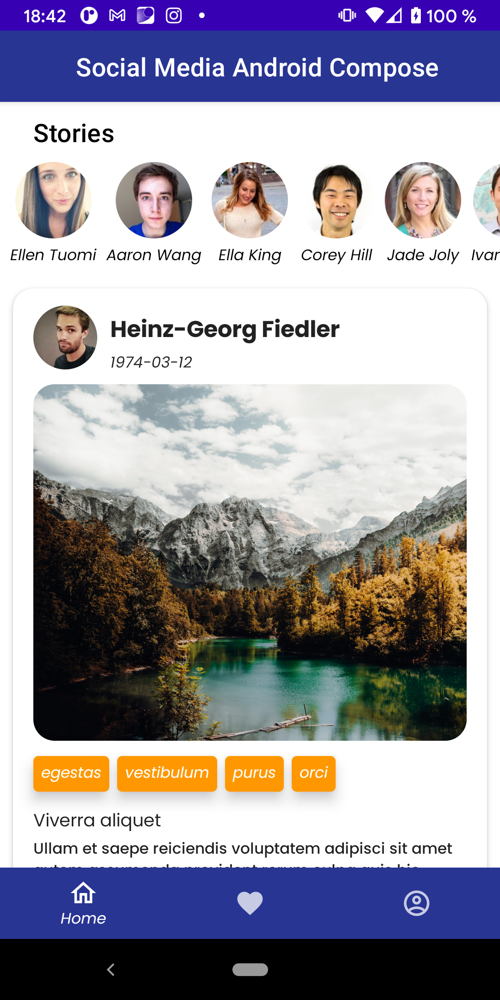&emsp;
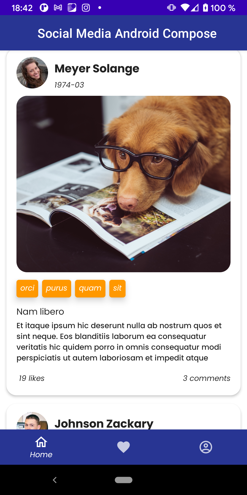&emsp;
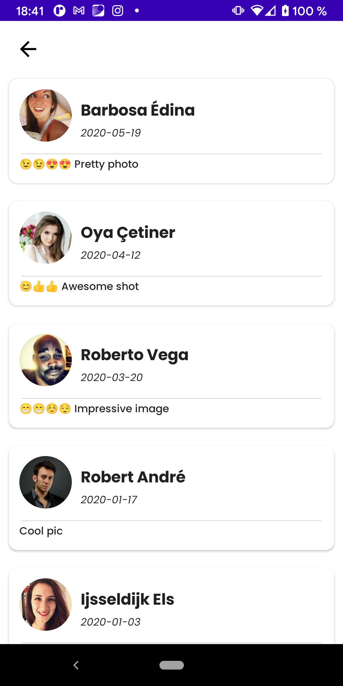&emsp;
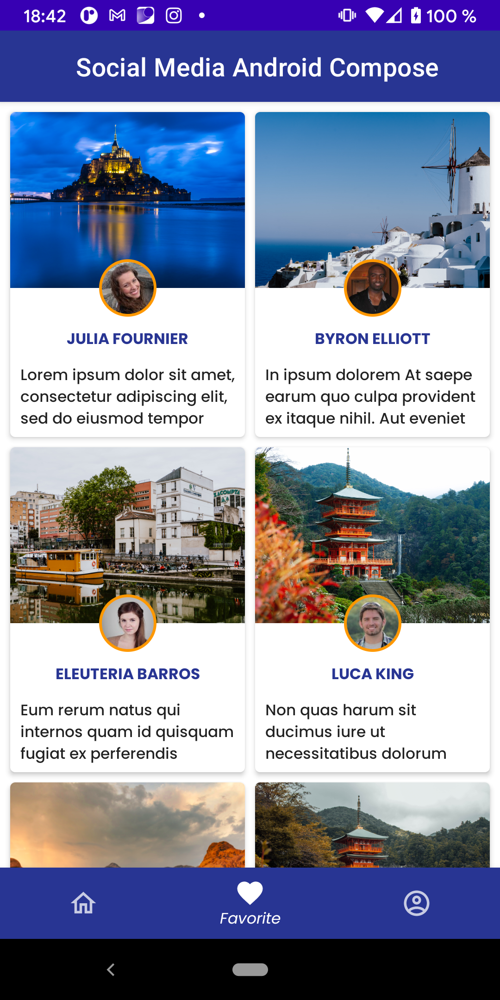&emsp;
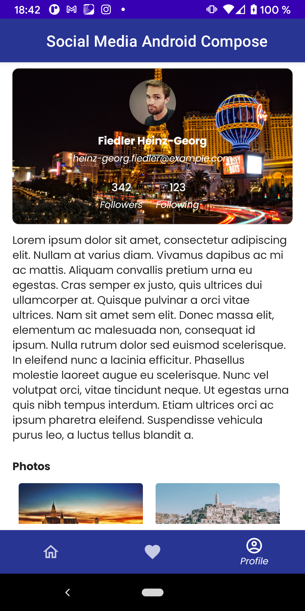&emsp;
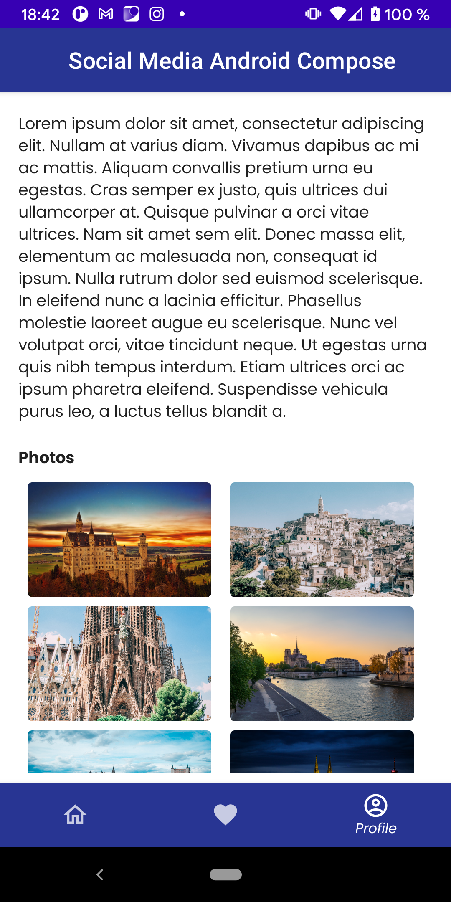

###  Dark Mode

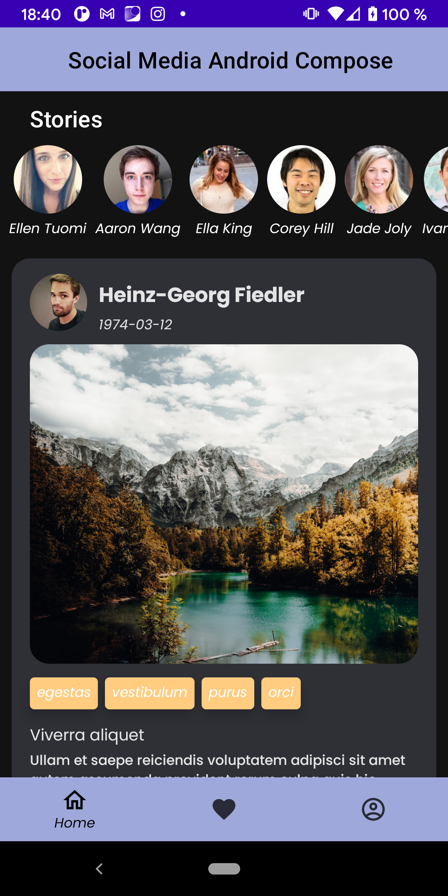&emsp;
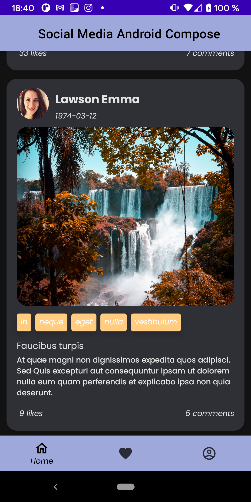&emsp;
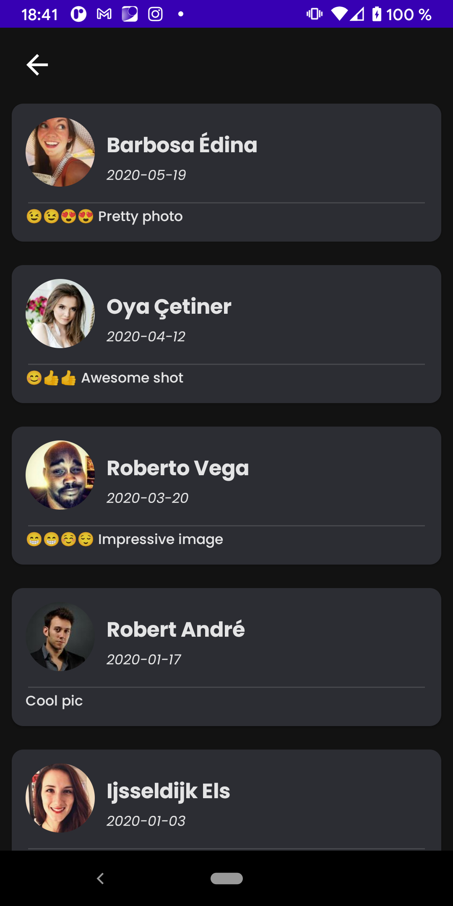&emsp;
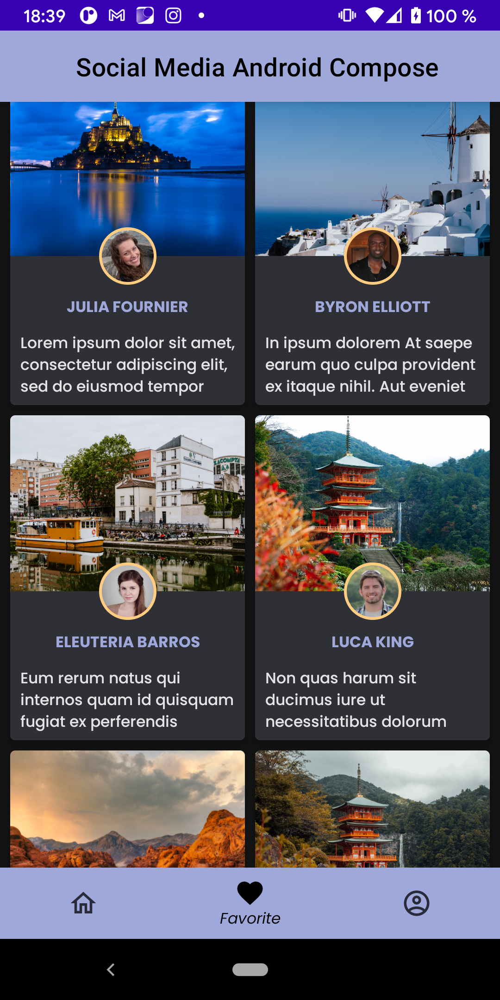&emsp;
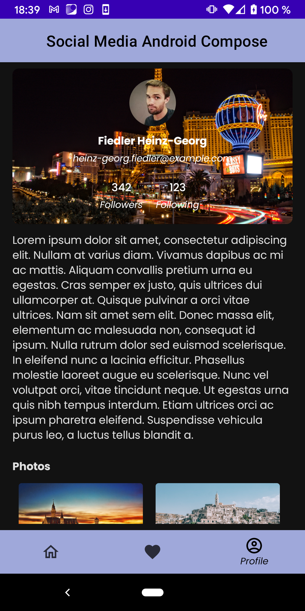&emsp;
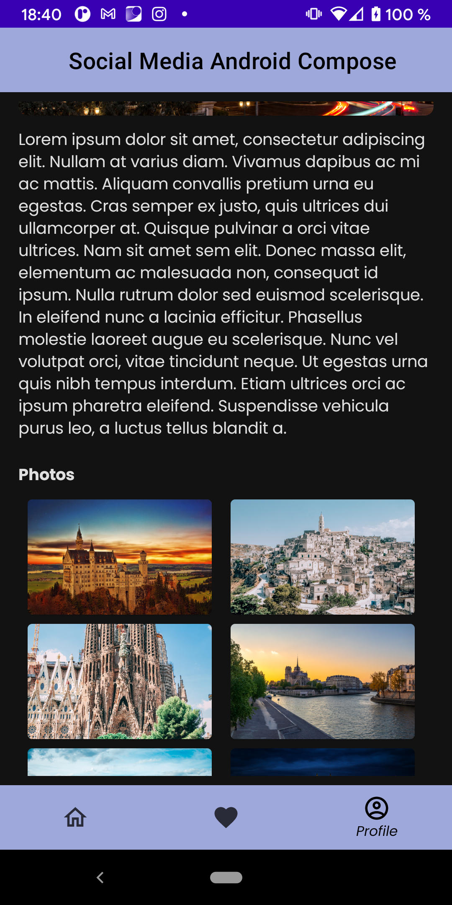

## License
```xml
Designed and developed by 2021 miroljubTr

Licensed under the Apache License, Version 2.0 (the "License");
you may not use this file except in compliance with the License.
You may obtain a copy of the License at

   http://www.apache.org/licenses/LICENSE-2.0

Unless required by applicable law or agreed to in writing, software
distributed under the License is distributed on an "AS IS" BASIS,
WITHOUT WARRANTIES OR CONDITIONS OF ANY KIND, either express or implied.
See the License for the specific language governing permissions and
limitations under the License.